# Asteroids

> A real-time Twitter visualization that pays homage to Atari's Asteroids

To summarize this Processing sketch, the user can search Twitter for a search term, then whenever a tweet with that search term occurs in real time, an asteroid is created on screen. The user then moves their gun and fires a bullet at the asteroid to read the tweet. This game clearly pays homage to Atari's Asteroids and presents a new, interesting way to visualize and experience data through a game-like guise.

### Using the Twitter Streaming API

The focus of this visualization was to work with real-time data and have it influence game design. A logical choice for easy-to-use,  real-time data was the Twitter API, which is well documented and a socially relevant dataset to work with. As such, I looked into [Twitter for Java](http://twitter4j.org/en/index.html) and [Twitter Streaming API](https://github.com/neufuture/SimpleTwitterStream/) solutions for Processing, which were both available, had examples, and provided a good framework to learn how the Twitter API worked and how to use it for data visualization.

Below is the complete Twitter class that is used in the Asteroids sketch.

~~~
/////////////////////////////////
// Twitter Streaming API class //
/////////////////////////////////

// OAuth info
static String OAuthConsumerKey = "XXXX";
static String OAuthConsumerSecret = "XXXX";
// access token info
static String AccessToken = "XXXX-XXXX";
static String AccessTokenSecret = "XXXX";

class Twitter {
  // search keyword; empty to start
  String[] keywords = { 
    ""
  };
  TwitterStream twitter = new TwitterStreamFactory().getInstance();
 
  Twitter() {
    setup();
  }
  
  void setup() {
    connectTwitter();
    twitter.addListener(listener);
    twitter.filter(new FilterQuery().track(keywords));
  }

  // Initial connection
  void connectTwitter() {
    twitter.setOAuthConsumer(OAuthConsumerKey, OAuthConsumerSecret);
    AccessToken accessToken = loadAccessToken();
    twitter.setOAuthAccessToken(accessToken);
  }

  // Loading up the access token
  private AccessToken loadAccessToken() {
    return new AccessToken(AccessToken, AccessTokenSecret);
  }

  // This listens for new tweet
  StatusListener listener = new StatusListener() {
    public void onStatus(Status status) {
      // the tweet to display
      String tweet = "@" + status.getUser().getScreenName() + ":\n" + status.getText();
      // create an asteroid
      tempAsteroids.add(new Asteroid(random(0, width-250), random(0, height), status.getText().length(), tweet));
    }
    // need the following methods for the StatusListener to work
    public void onDeletionNotice(StatusDeletionNotice statusDeletionNotice) {
      println("Got a status deletion notice id:" + statusDeletionNotice.getStatusId());
    }
    public void onTrackLimitationNotice(int numberOfLimitedStatuses) {
      println("Got track limitation notice:" + numberOfLimitedStatuses);
    }
    public void onScrubGeo(long userId, long upToStatusId) {
      println("Got scrub_geo event userId:" + userId + " upToStatusId:" + upToStatusId);
    }
    public void onException(Exception ex) {
      ex.printStackTrace();
    }
  };

  // set search keyword
  void setKeywords(String s) {
    keywords[0] = s;
    twitter.filter(new FilterQuery().track(keywords));
  }
  
  // get search keyword for display in the visualization
  String getKeyword() {
    return keywords[0];
  }
}
~~~

There is only a mild amount of setup involved to get the Twitter API up and running in a Processing sketch. The code from my class that highlights this initialization process is below.

~~~
// get an instance of the TwitterStream from twitter4j library
TwitterStream twitter = new TwitterStreamFactory().getInstance();

Twitter() {
  setup();
}

void setup() {
  connectTwitter();
  twitter.addListener(listener); // this listener will listen for new tweets
  twitter.filter(new FilterQuery().track(keywords)); // filter out the tweets we listen for based on whatever keyword is passed in
}

// Initial connection to the Twitter API
void connectTwitter() {
  twitter.setOAuthConsumer(OAuthConsumerKey, OAuthConsumerSecret);
  AccessToken accessToken = loadAccessToken();
  twitter.setOAuthAccessToken(accessToken);
}

// Loading up the access token
private AccessToken loadAccessToken() {
  return new AccessToken(AccessToken, AccessTokenSecret);
}
~~~

What made this particular Processing sketch difficult was programming without understanding when certain events were going to happen. Since objects were being created at unknown time intervals based on incoming tweets, making sure the flow of the main program had the proper order was very important to preventing errors that would cause the program to stop.

<!--
A data type in Java called `ArrayList` contained all the asteroids in this sketch. The main reason for this is that an `ArrayList` is a dynamic list type.
-->

## Gameplay

A user loads the game and see's a welcome screen with how to proceed. It will tell them what button to press whether there is a Super Nintendo controller plugged into the computer or not.

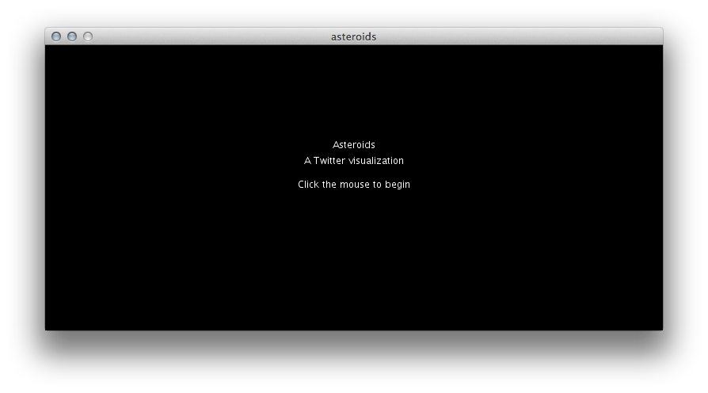

The user is presented with a blank asteroid field. 

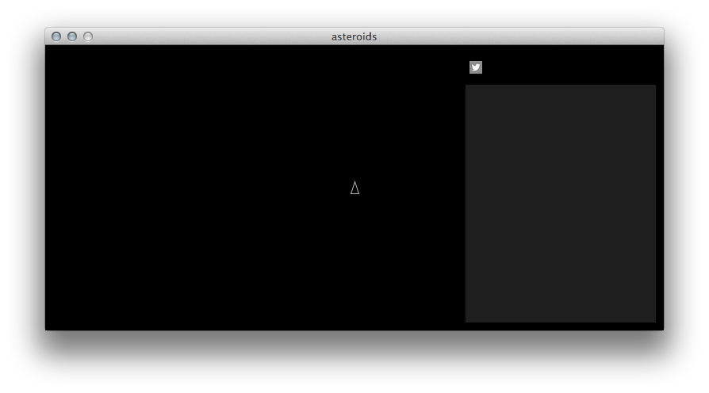

A singular Twitter button is on-screen for the user to press. The color changes when the mouse hovers over. 

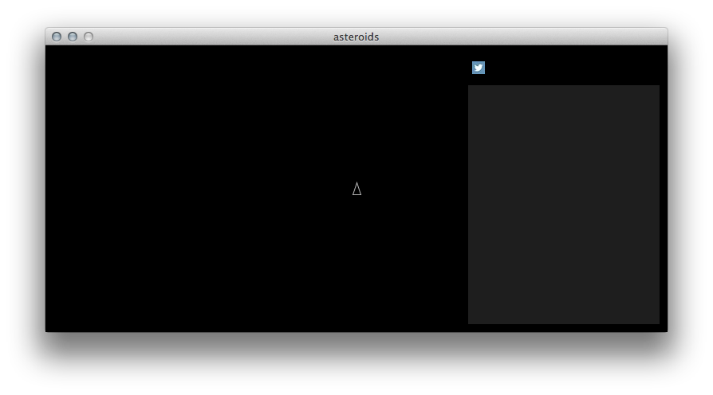

Upon clicking the button, the user is presented with a search box within which to enter a search term. This term will be the real-time Twitter search term.

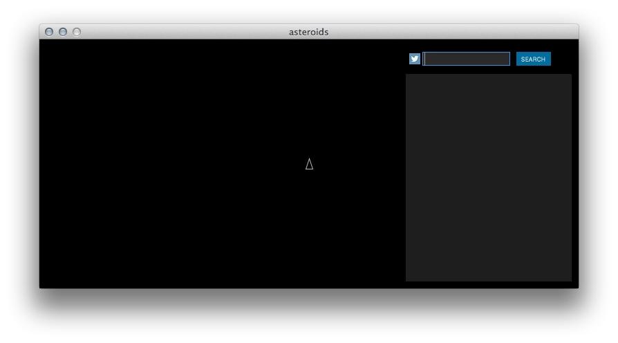
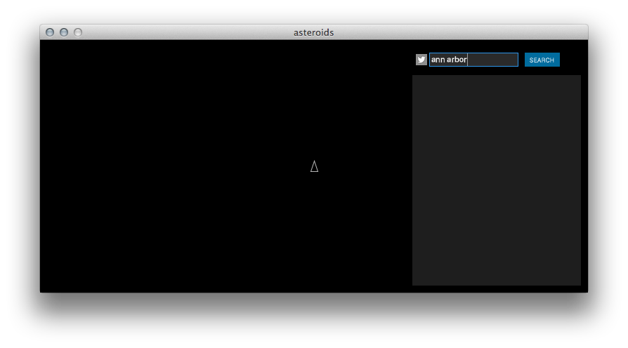

Upon entering the search term and clicking Search (or pressing on Enter on the computer keyboard), the program will wait until a tweet with the search term has occurred in real-time. The search term is always visible in blue (two screenshots below).

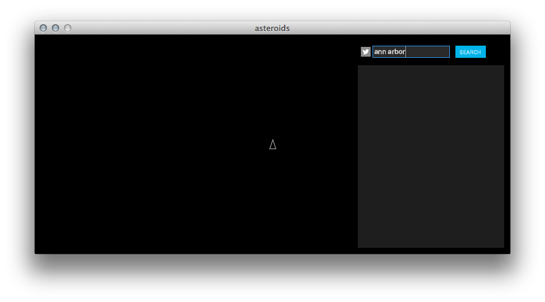
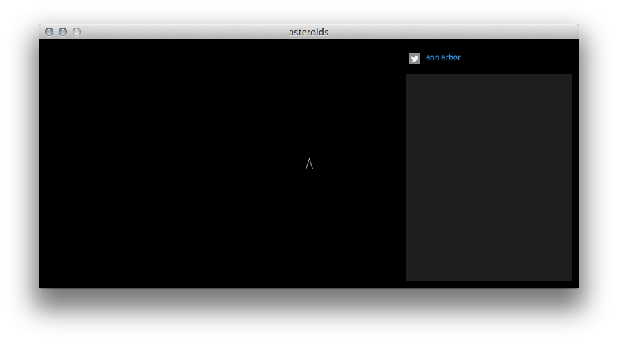

When a tweet occurs with the search term, an asteroid will appear in the field. The size of the asteroid correlates to the number of characters in a tweet (0-140). 

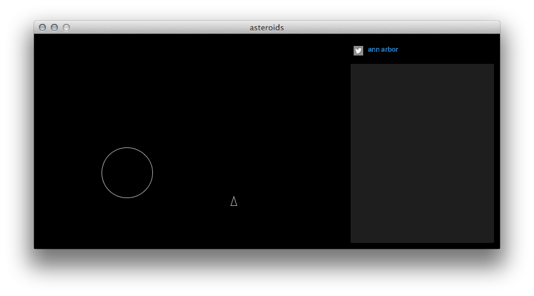

Asteroids are gravitationally attracted to the triangle gun, and the gun is able to move freely around the asteroid field.

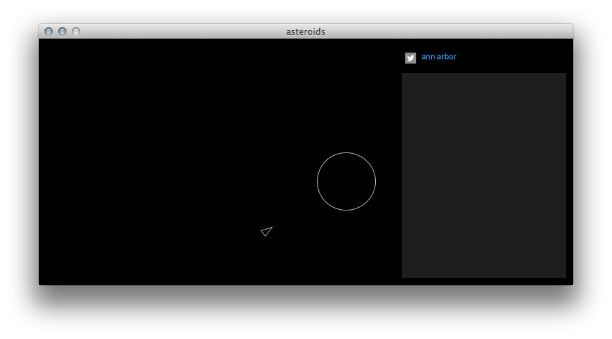

The user may fire a bullet to shoot the asteroid, and when the asteroid has been hit, the tweet will appear in the textbox on the right.

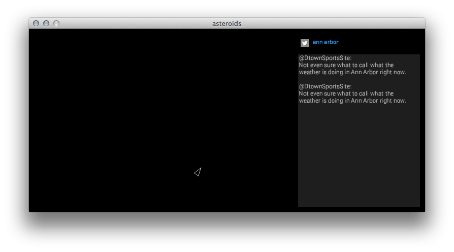
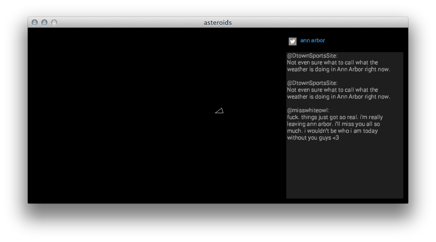
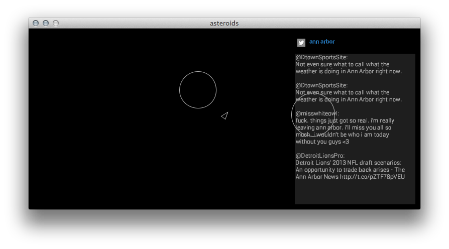
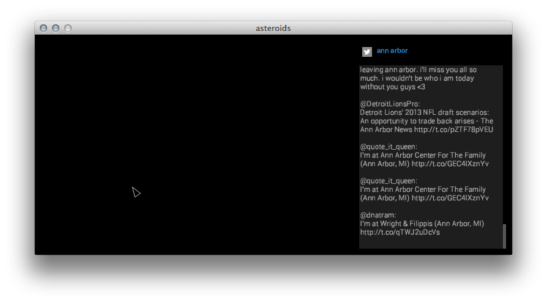

The user may use the mouse to navigate to the text box. When the user hovers over the scrollbar, they can click and drag to move up and down the textbox in able to view all of the tweets they have encountered.

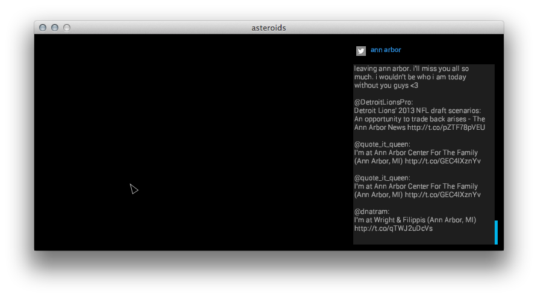
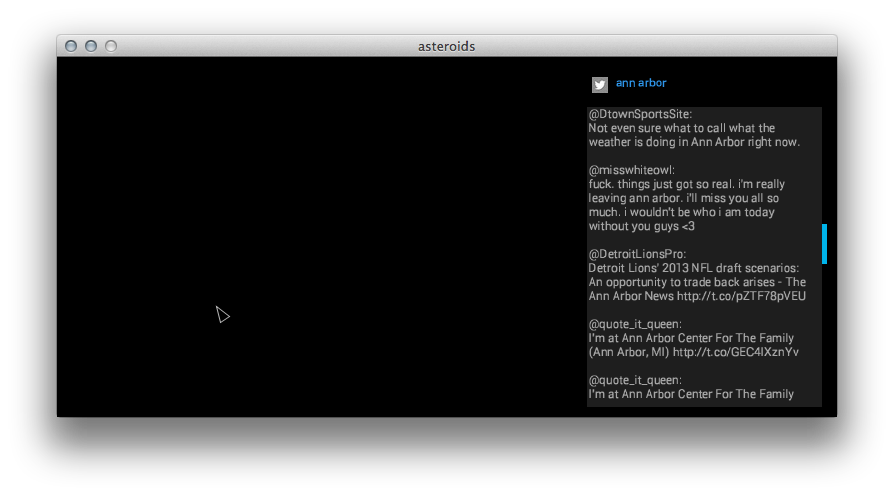